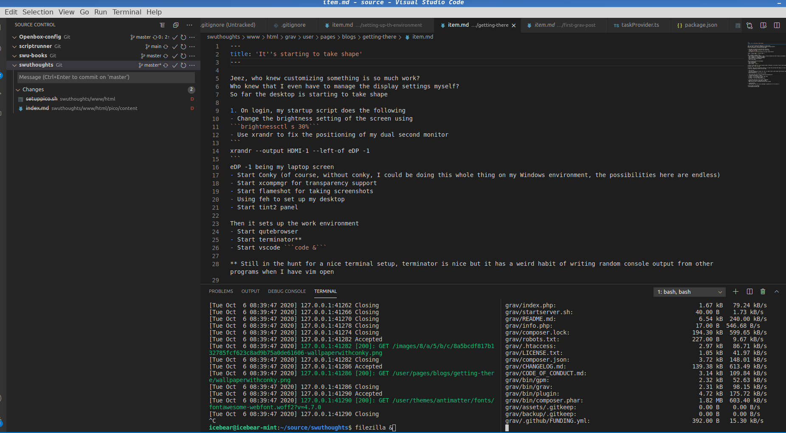

After weeks of tinkering, I have finally gotten my workspace to a state that I can appreciate.
Is this a little overkill for sending my grav blog to FTP?

This was all in VSCode,
I run my terminal commands in one split pane, and then FTP upload on the other.

This, my friends, is what HOLLYWOOD had promised us...
Little did I know this was always achievable.

All you need is a little linux magic... On the other hand, you probably CAN do this on Windows.
